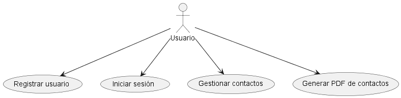
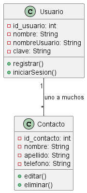
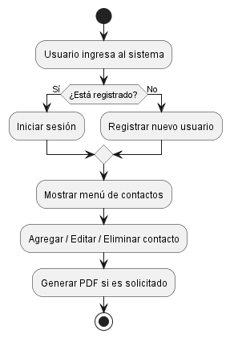
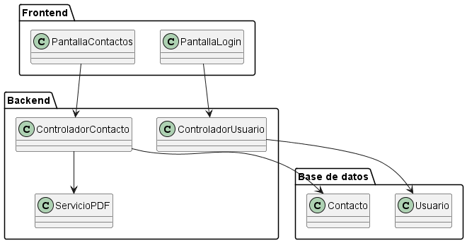

# 📄 Documentación de Requisitos (SRS)

**Nombre del proyecto:** Gestión de Contactos  
**Fecha:** 2025-05-22  
**Duración estimada:** 3 meses  

---

## 1. Introducción

### 1.1 Propósito
Este documento tiene como propósito definir y detallar los requisitos funcionales y no funcionales del sistema de gestión de contactos. Está dirigido al equipo de desarrollo, diseñadores, testers y partes interesadas del proyecto, para asegurar una comprensión común de las funcionalidades y restricciones del sistema. Su objetivo principal es servir como base para el diseño, implementación y validación del producto.

### 1.2 Alcance del proyecto
- El sistema permitirá a los usuarios:

Registrar, editar, eliminar y visualizar contactos personales.
Asociar contactos a un usuario autenticado.
Guardar información básica como nombre, apellido y teléfono de cada contacto.
Buscar contactos por nombre o número de teléfono.

- El sistema no incluirá funcionalidades como:

Integración con redes sociales.
Chat en tiempo real entre contactos.
Sincronización automática con otras aplicaciones (como Google Contacts).

### 1.3 Visión general del documento
Este documento está estructurado en secciones que describen el propósito del sistema, su alcance, sus funcionalidades específicas, las características de los usuarios, restricciones técnicas, modelo de datos, diagramas UML, y la metodología empleada en el desarrollo del proyecto. También se incluye un glosario y un historial de cambios que permiten mantener actualizado el seguimiento del documento.

---

## 2. Descripción general

### 2.1 Perspectiva del 
El sistema será una aplicación web de propósito general, accesible mediante navegadores modernos. Está diseñado como un sistema independiente que permitirá a cada usuario gestionar su lista de contactos personales de manera privada y segura. No forma parte de otro sistema, pero podrá ser escalado en el futuro para integrarse con servicios de terceros mediante APIs.

### 2.2 Funciones del producto
El sistema proporcionará las siguientes funcionalidades clave:
- Registro y autenticación de usuarios.
- Registro de contactos asociados a un usuario autenticado.
- Edición y eliminación de contactos.
- Visualización de una lista de contactos.
- Búsqueda y filtrado de contactos por nombre o teléfono.
- Exportación de contactos en formato PDF.

### 2.3 Características del usuario
El sistema será utilizado por:
- **Usuarios finales**: Personas que desean guardar y organizar sus contactos personales. No requieren conocimientos técnicos.
  - Necesitan una interfaz simple e intuitiva.
  - Desean tener acceso rápido a sus contactos desde cualquier dispositivo.
- **Administrador del sistema** (opcional): Podría tener acceso a funcionalidades de mantenimiento o respaldo de datos si se implementa una versión con más niveles de rol.

### 2.4 Restricciones
- El sistema debe desarrollarse usando tecnologías seleccionadas por el equipo (por ejemplo: Angular para el frontend, Spring Boot para el backend y MySQL como base de datos).
- El desarrollo debe completarse en un período de 3 meses, siguiendo el cronograma académico.
- La interfaz debe estar en idioma español.
- El sistema debe ser compatible con navegadores actuales (Chrome, Firefox, Edge).

### 2.5 Suposiciones y dependencias
- Se asume que todos los miembros del equipo cuentan con conexión a internet y equipo informático adecuado para el desarrollo.
- El sistema dependerá de un servidor web (Apache o Nginx) para su despliegue.
- Se usará una base de datos relacional (MySQL o similar) para almacenar la información.
- Los usuarios tendrán acceso a una cuenta de correo válida para el registro y recuperación de contraseña.

### 2.6 Valor del producto

**Número de personas**: 4  
**Horas por día**: 6  
**Días por mes**: 20 (4 semanas laborales)  
**Meses estimados de trabajo**: 1.5  

#### Cálculo del costo total del trabajo:

- **Sueldo mensual estimado (COP)**: $1,300,000  
- **Número de meses**: 1.5  
- **Costo por persona** = $1,300,000 × 1.5 = **$1,950,000**  
- **Costo total para 4 personas** = $1,950,000 × 4 = **$7,800,000**

#### Cálculo de horas trabajadas:

- **Horas trabajadas por mes por persona** = 6 h/día × 20 días = **120 horas/mes**  
- **Total de horas por persona en 1.5 meses** = 120 × 1.5 = **180 horas**  
- **Total de horas para 4 personas** = 180 × 4 = **720 horas**  

#### Valor por hora:

- $7,800,000 / 720 horas = **COP$10,833.33/hora (aproximadamente)**
---
**Valor total del trabajo**: **COP$7,800,000**  
Este valor representa el esfuerzo estimado del equipo en la fase inicial del desarrollo del sistema de gestión de contactos, durante un período de 1.5 meses.

---

## 3. Requisitos específicos

### 3.1 Requisitos funcionales

- RF1: Registrar un nuevo usuario.
- RF2: Registrar contacto vinculado a usuario.
- RF3: Editar o eliminar contactos.
- RF4: Listar todos los contactos del usuario.

### 3.2 Requisitos no funcionales

#### Seguridad
- Autenticación de usuarios mediante nombre y contraseña.

#### Usabilidad
- Interfaz clara y accesible desde dispositivos.

#### Infraestructura
- Servidor básico  con base de datos relacional (MySQL).
---

## 4. Análisis y metodologías

### 4.1 Metodología utilizada
Se utilizará una metodología ágil basada en Scrum (TRELLO). El desarrollo se organizará en sprints quincenales, con reuniones semanales para revisión de avances. Esta metodología permitirá adaptarse a cambios en los requerimientos, realizar entregas incrementales y mantener una comunicación constante entre los miembros del equipo.

### 4.2 Design Thinking aplicado
Para garantizar que el sistema sea útil y centrado en el usuario, se aplicó el enfoque de Design Thinking en cinco fases:

- **Empatizar:** Se realizaron encuestas informales a estudiantes y profesionales para entender cómo organizan sus contactos personales actualmente.
- **Definir:** Se identificó que los usuarios necesitan una forma rápida, segura y accesible de registrar y consultar contactos desde cualquier lugar.
- **Idear:** Se propusieron funcionalidades clave como el registro de usuarios, listado de contactos y exportación en PDF.
- **Prototipar:** Se diseñó una interfaz sencilla con campos de búsqueda y botones claros.
- **Testear:** Se aplicaron pruebas básicas de usabilidad con usuarios no técnicos, recolectando retroalimentación para ajustes.

### 4.3 Priorización MoSCoW

| Prioridad     | Funcionalidad           | Justificación                        |
|---------------|-------------------------|--------------------------------------|
| Must Have     | Registro de usuario     | Es la base del sistema               |
| Must Have     | Registro de contactos   | Permite cumplir el objetivo principal del sistema |
| Must Have     | Edición y eliminación   | Permite mantener la información actualizada |
| Should Have   | Generación de informes PDF | Mejora en la toma de decisiones      |
| Could Have    | Personalización visual  | Mejora la experiencia de usuario     |
| Could Have    | Etiquetas o categorías  | Permite organizar mejor los contactos |
| Won’t Have    | Chat en tiempo real     | No es necesario para el alcance actual |
| Won’t Have    | Integración con redes sociales | No es relevante para esta versión   |

---

## 5. Modelado del sistema

### 5.1 Casos de uso

### 5.2 Diagrama de clases

### 5.3 Diagrama de actividades

### 5.4 Diagrama de paquetes

---

## 6. Anexos

### 6.1 Glosario
- **Backend**: Parte del sistema que se encarga del procesamiento de datos, reglas de negocio y gestión de la base de datos, como almacenar, editar o eliminar contactos.

- **Frontend**: Interfaz visual con la que interactúa el usuario para registrar, consultar o editar información de contactos.

### 6.2 Historial de cambios

| Versión | Fecha       | Descripción              | Autor         |
|---------|-------------|--------------------------|---------------|
| 1.0     | 18/05/2025  | Versión inicial del SRS  | Marco Antonio |
| 1.1     | 22/05/2025  | Cambio DB a Mysql        | Brandow Claros|

---

> Este documento será actualizado conforme avance el proyecto.
